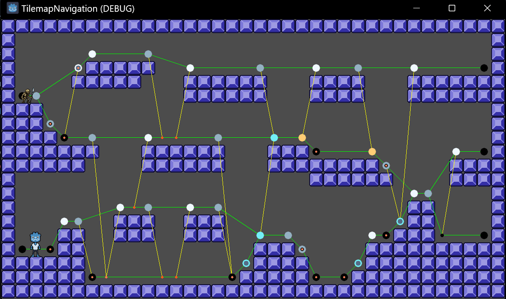
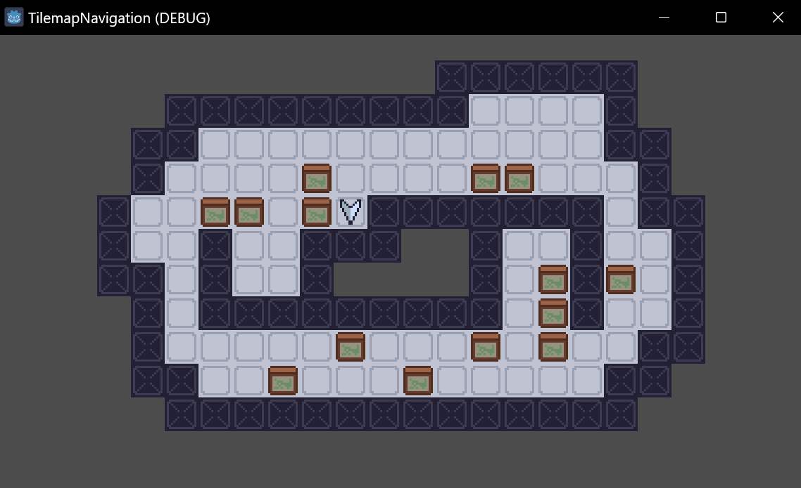
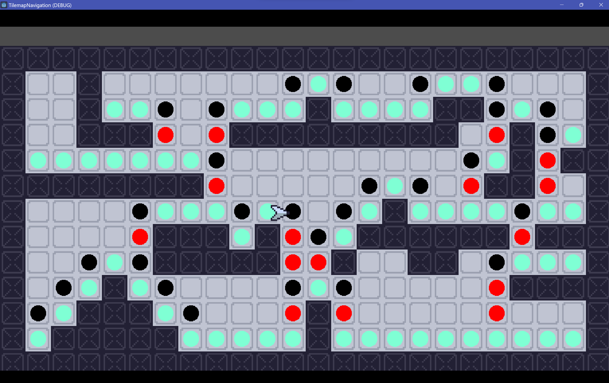
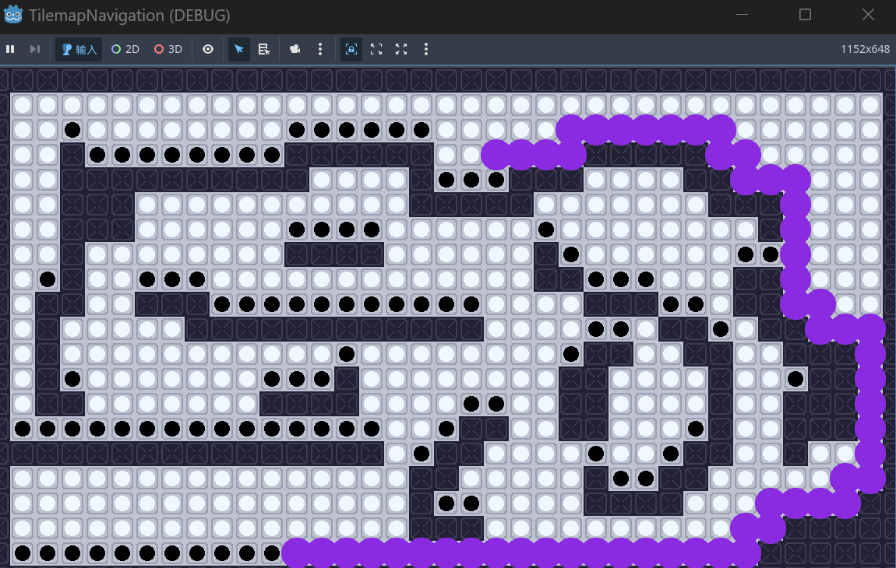

# MyGodot2DNavigation

各种gd实现的2D寻路，特别是2D横板寻路。
- 不考虑寻路实体是否可达，可以参考 网格横板寻路 和 map-path-finder这两个demo
- 考虑寻路实体是否可达，可以参考 基于B站搬运视频的横板寻路 
- 实现了一个路径显示单例
- 附加一个平面网格寻路demo，参考[码客二十二](https://space.bilibili.com/204475293)的教程实现，项目中部分素材来自其demo。

## 基于B站搬运视频的横板寻路

- 基于自定义路径点的横板寻路
- [原作者YouTube链接](https://www.youtube.com/@TheSolarString)
- [原项目GitHub链接](https://github.com/solarstrings/Godot4.x_Advanced2DPlatformerPathFinding)
- 我把他的C#脚本改成了GD脚本，其他素材基本来自该作者
- BUG记录：
	- 寻找下坠点时只考虑了一边（已修复）
	- 适配tilemaplayer后会出现错误跳跃的bug(临时修复)
		- 如果distance设置为5，会导致玩家在测试地图右侧部分移动失败
		- 目前的修复方法是设置为4，暂时无好的修复方法。

## 平面网格寻路

- 基于AstarGrid2D的平面网格寻路（移动方式为按格移动）
- [原作者B站视频](https://www.bilibili.com/video/BV1PeYzefE7q/?spm_id_from=333.337.search-card.all.click&vd_source=912de37828db7e4feff5c9492864d51c)
- [原项目链接](https://merxon22.github.io/GodotArchive/zh/posts/navigation_tilemap/)

## 网格横板寻路

- 基于AstarGrid2D的横板寻路
	- 通过权重设置已实现路径寻找
		- 分为 不可达点、平台点、平台边缘点、平台下落点
		- 实际寻路时会先找到起点/终点对应的平台点为起点终点进行寻路
	- 可能的问题：
		- 两个相近平台之间的寻路是直接联通而不是先下去再上来。这不是大的问题，具体表现还是取决于实体的实际性能。
		- 目前使用tilemap，且需要设置自定义数据，未来可以改进
	- player
		- 目前存在特定情况下移动错误的bug，不过可以通过及时重新寻路解决
		- 可以实时实现寻路路径

## map-path-finder

- 基于AstarGrid2D的横板寻路（简化版）
	- 这里只分为不可达点、平台点和空中点。优先平台点。
	- 目前没有移动功能，只有一个路径显示功能（每隔1s更新一次）

## PathShowTool

- 路径显示单例
	- 基本使用方法：
		- 由节点请求该单例生成路径，向单例传递绑定的节点、路径和路径显示的属性（颜色、半径）
		- 绑定的节点在将要离开场景树时会清除与之相关的路径显示。
	- 使用示例：参考 map-path-finder 和 网格横板寻路 中的demo
	- 移植：需要将整个文件夹都移动出来，同时在新项目中添加自动加载
	- 测试：缺少多个实体同时显示路径、清除路径显示等功能的测试
